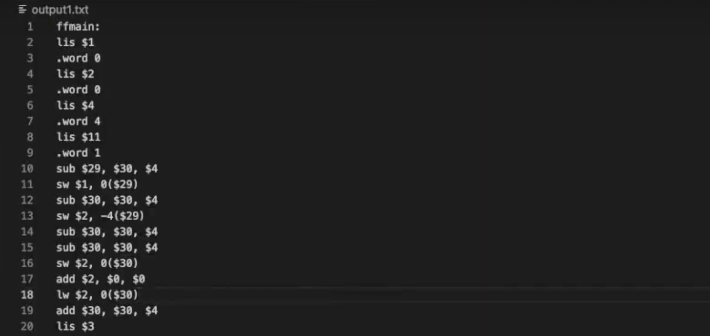

<!-- contact shields -->
[gmail-shield]: https://img.shields.io/badge/Gmail-D14836?style=for-the-badge&logo=gmail&logoColor=white
[gmail-url]: mailto:theivikaran.jathurshan@gmail.com
[outlook-shield]: https://img.shields.io/badge/Microsoft_Outlook-0078D4?style=for-the-badge&logo=microsoft-outlook&logoColor=white
[outlook-url]: mailto:jtheiv@outlook.com
[linkedin-shield]: https://img.shields.io/badge/-LinkedIn-black.svg?style=for-the-badge&logo=linkedin&colorB=555
[linkedin-url]: https://linkedin.com/in/jathurshan-t

<!-- project summary shields -->
[contributors-shield]: https://img.shields.io/github/contributors/jath-git/portfolio.svg?style=for-the-badge
[contributors-url]: https://github.com/jath-git/portfolio/graphs/contributors
[stars-shield]: https://img.shields.io/github/stars/jath-git/portfolio.svg?style=for-the-badge
[stars-url]: https://github.com/jath-git/portfolio/stargazers

<!-- programming language shields -->
[python-shield]: https://img.shields.io/badge/Python-3776AB?style=for-the-badge&logo=python&logoColor=white
[javascript-shield]: https://img.shields.io/badge/JavaScript-F7DF1E?style=for-the-badge&logo=javascript&logoColor=black
[c++-shield]: https://img.shields.io/badge/C%2B%2B-00599C?style=for-the-badge&logo=c%2B%2B&logoColor=white
[c#-shield]: https://img.shields.io/badge/C%23-239120?style=for-the-badge&logo=c-sharp&logoColor=white
[html-shield]: https://img.shields.io/badge/HTML5-E34F26?style=for-the-badge&logo=html5&logoColor=white
[css-shield]: https://img.shields.io/badge/CSS3-1572B6?style=for-the-badge&logo=css3&logoColor=white

<!-- start document -->
<div id="start"></div>

<!-- contact info -->
[![Gmail][gmail-shield]][gmail-url]
[![Outlook][outlook-shield]][outlook-url]
[![LinkedIn][linkedin-shield]][linkedin-url]

<!-- project overview -->
<br />
<div align="center">
  <!-- project image -->
  <a href="https://github.com/jath-git/compiler">
    
  </a>

  <h3>Compiler</h3>
  <!-- languages used in project -->
  <div>
    
    
    
  </div>
  <!-- project description -->
    <p>
    A compiler in Racket for a subset of C++. Applied language recognition theories. Created testing tools. 
    <br />
    </p>
</div>

## Getting Started
* [Racket v8.5 or latest version](https://download.racket-lang.org)
* [Bash 3.2 or latest version](https://itsfoss.com/install-bash-on-windows/)

## Instructions
* Run compiler
```sh
racket compiler.rkt [action] [int] [int] < [input]
```
where action is one of *scan, parse, analyze, assembly, binary*
and input is *code file*
* Run test suite
```sh
chmod u+x compile_suite.sh
```
```sh
./compile_suite.sh [input]
```
where input is *test file*

### Code File Template
```console
[optional procedure(s) with body format like main]

int main(int [id name], int [id name]) {
   [optional int declaration or int* declaration set to NULL]
   [optional statements (e.g. arithmetic, if, while)]
   return [int expression];
}
```

### Test File Template
```console
Each line must have the following 5, in order:
   1) Path to input file
   2) Compilation action (e.g. scan, parse, analyze, assembly, binary) or . which defaults to assembly
   3) First int of main function or . which defaults to 0
   4) Second int of main function or . which defaults to 0
   5) Path to output file or . which defaults to terminal stdout/stderr

Newline at the end
```

<!-- project summary -->
[![Contributors][contributors-shield]][contributors-url]
[![Stargazers][stars-shield]][stars-url]
<p align="center"><a href="#start">back to top</a></p>